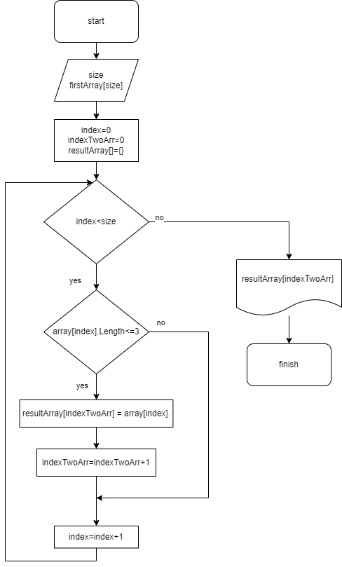

# Задача #
1. __Условие__

Написать программу, которая из имеющегося массива строк формирует новый массив из строк, длина которых меньше, либо равна 3 символам. Первоначальный массив можно ввести с клавиатуры, либо задать на старте выполнения алгоритма. При решении не рекомендуется пользоваться коллекциями, лучше обойтись исключительно массивами.

2. __Алгоритм Решения__



3. __Отображение программного кода__ 

```c#

string[] firstArray = { "Hello", "2", "world", ":-)" };
string[] arrayTwo = new string[firstArray.Length];
int indexTwoArr = 0;

for (int i = 0; i < firstArray.Length; i++)
    {
        if (firstArray[i].Length <>= 3)
        {
            arrayTwo[indexTwoArr] = array[i];
            indexTwoArr++;
        }
    }

Console.Write("[");
    for (int i = 0; i < arrayTwo.Length; i++)
    {
        if (i != arrayTwo.Length - 1) Console.Write($"{arrayTwo[i]}, ");
        else Console.Write($"{arrayTwo[i]}");
    }
    Console.WriteLine("]");
